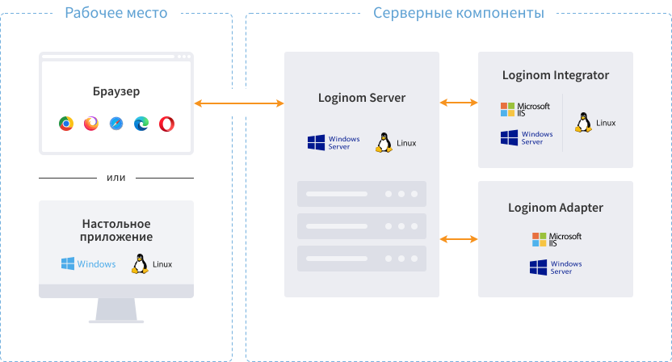

# Loginom — Administrator Manual

The [Loginom](https://loginom.ru) analytical platform can be operated in server mode for teamwork, and as a desktop application for personal analytics.

Серверный режим для ОС [Windows](./windows/README.md) доступен в редакциях [Team](https://help.loginom.ru/userguide/compare-editions.html#team), [Standard](https://help.loginom.ru/userguide/compare-editions.html#standard) и [Enterprise](https://help.loginom.ru/userguide/compare-editions.html#enterprise). Для ОС [Linux](./linux/README.md) доступны редакции Standard и Enterprise.

Настольное приложение, предназначенное для автономной обработки данных на персональном компьютере, доступно в редакциях [Community](https://help.loginom.ru/userguide/compare-editions.html#community) и [Personal](https://help.loginom.ru/userguide/compare-editions.html#personal). Они содержат единственный компонент [Loginom Desktop](./desktop/README.md).

Требуют инсталляции и функционируют в виде Windows или Linux приложения.
