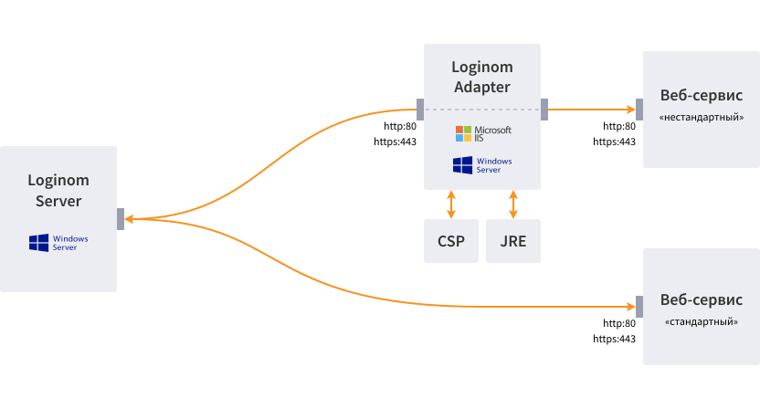

# Loginom Adapter

There are [components of integration with the SOAP and REST services](https://help.loginom.ru/userguide/integration/web-services/) in the analytical Loginom platform that implement the most wide-spread variants of interaction with the web services. But some web services, for example, CRB, use the individual protocols and data encryption which preclude interaction using the standard Loginom means. Loginom Adapter provides a solution to this problem (hereafter referred to as the *Adapter*).

The *Adapter* is an intermediate web service between the workflow executed in Loginom and the external web services. Interaction with the *Adapter* from the Loginom workflow is performed according to the standard SOAP protocol using the [Web service invocation](https://help.loginom.ru/userguide/processors/integration/soap-request.html) node. In return the *Adapter performs the following tasks:*:

* преобразует полученный из сценария Loginom SOAP-запрос к формату запроса внешнего веб-сервиса;
* направляет преобразованный запрос во внешний веб-сервис;
* получает ответ внешнего веб-сервиса;
* преобразует полученный ответ и в формате SOAP возвращает его сценарию Loginom.

## System Requirements

### Hardware

| Component | Minimum | Recommended |
|:--- |:---|:--- |
| Processor | Intel Core 2 Duo | Intel Xeon |
| Immediate-access store | 1 GB | 8 GB |
| Hard disk drive | 10 GB | 500 GB |
| Management | Keyboard, mouse | &nbsp; |

### Required Software

| Component | Minimum | Recommended |
|:--- |:---|:--- |
| Operating system | Windows 7 | Windows Server 2008 and higher |
| Microsoft IIS | Version 5.1 or higher | Version 7.5 and higher |
| .Net Framework | Version 3.5 | &nbsp; |

> **Note**: Loginom Adapter uses .Net Framework, version 3.5 in the work process. The evidence from application usage practice shows that compatibility with.Net Framework, version 4.5 is possible.

The availability of some IIS and .Net Framework components is required for the  *Adapter* operation. A detailed description is provided in the [Installation](.\setup\README.md) section.

### Optional Software

Для работы с некоторыми веб-сервисами могут использоваться сторонние криптопровайдеры. In such cases, these components must be installed with the *Adapter*.

Selection of cryptography service provider and its version is stipulated by support of the definite encryption algorithms required for interaction with the particular web services. Corresponding certificates will be required for use of a particular web service with encryption.