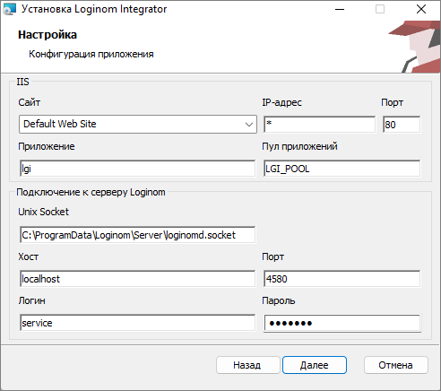

# Loginom Integrator Installation

The installer file name: `LoginomIntegrator_6.x.x.msi`, where 6.x.x – figures denote software version and release.

> **Note:** The Loginom Integrator version must comply with the Loginom server version being used.

## Enabling IIS Components

Execute the following command in the command line as an administrator:

```cmd
dism /online /enable-feature /FeatureName:IIS-WebServerRole /FeatureName:IIS-WebServer /FeatureName:IIS-WebServerManagementTools /FeatureName:IIS-ManagementScriptingTools
```

## Enabling IIS Components for the Loginom Integrator

Installed NetFramework v4.5+ is required for proper Loginom Integrator operation.

Installation of the following components is required:

Execute the following command in the command line as an administrator:

```cmd
:: For windows 2008/7/2012/8:
dism /online /enable-feature /FeatureName:IIS-ApplicationDevelopment /FeatureName:IIS-ISAPIExtensions /FeatureName:WAS-WindowsActivationService /FeatureName:WAS-ProcessModel /FeatureName:IIS-NetFxExtensibility /FeatureName:WAS-NetFxEnvironment /FeatureName:WAS-ConfigurationAPI /FeatureName:WCF-HTTP-Activation

:: For windows 2012r2/8.1/2016/10:
dism /online /enable-feature /FeatureName:IIS-ApplicationDevelopment /FeatureName:IIS-ISAPIExtensions /FeatureName:WAS-WindowsActivationService /FeatureName:WAS-ProcessModel /FeatureName:IIS-ASPNET45 /FeatureName:IIS-NetFxExtensibility45 /FeatureName:NetFx4Extended-ASPNET45 /FeatureName:WCF-Services45 /FeatureName:IIS-ISAPIFilter /FeatureName:WCF-HTTP-Activation45 /all

::Register ASP.NET for windows 2008/7/2012/8/2012r2/8.1:
"%WinDir%\Microsoft.NET\Framework64\v4.0.30319\Aspnet_regiis.exe" -iru

:: Allow for execution of ISAPI modules for windows 2008/7/2012/8/2012r2/8.1:
"%windir%\system32\inetsrv\appcmd.exe" set config /section:isapiCgiRestriction /[path='%WinDir%\Microsoft.NET\Framework64\v4.0.30319\aspnet_isapi.dll'].allowed:True
```

***

The following server roles (windows 2016) must be installed at a minimum:

```txt
Web server (IIS) (8 installed of 43)
- Web server (8 installed of 34)
   - Security (1 installed of 9)
        * Request filtering
   - Common HTTP Features (3 installed of 6)
        * Default document
        * Directory Browsing
        *Static content
   - Application development (4 installed of 11)
        * ASP.NET 4.6
        * ISAPI Extensions
        * .NET Extensibility 4.
        * ISAPI Filters
```

## MSI Installation

### Graphic Interface

#### Run the Installer

It is required to click the  **Custom** button for installation with non-standard parameters in the **Installation type** dialog. To receive parameters of existing IIS sites in the installer interface, it is required to run it with administrator rights.

#### Installation directory

By default, installation is performed in the `%ProgramFiles%\BaseGroup\` directory;


#### Installation Parameters



**IIS** block:

* **Site** is a name of the existing IIS site in which Loginom Integrator will be deployed.
* **IP**, **Port** — binding parameters of the IIS site.
* **Application** — web application name.
* **Application pool** — name of the application pool supporting Loginom Integrator. If the pool does not exist, it will be created.

**Connection to the Loginom Server** block:

* **Host** — the Loginom server host address.
* **Port** — the Loginom server port.
* **Login**, **password** — credentials for [connection to the Loginom server](../server/setup.md#uchetnye-zapisi).
* **Show password** switches the password display mode.

### Command Line

```cmd
msiexec /i "LoginomIntegrator_6.x.x.msi" msi_options integrator_options
```

* `msi_options` — it is possible to find allowable values executing the following command in the command line: `msiexec /?`. The following commands can be especially useful:
   * `/l* "%TEMP%\loginom.msi.log"` — activation of installation logging.
   * `/qn` — "silent" installation without graphic interface mapping.
* `integrator_options` in `KEY=value form`:

| Key | Default value | Description |
|:--------- |:-------------|:------------- |
| IIS_APPNAME | `lgi` | IIS web application name |
| IIS_POOLNAME | `LGI_POOL` | Name of the created IIS application pool |
| IIS_WEBSITENAME | `Default Web Site` | IIS site name |
| IIS_WEBSITEIPADDRESS | `0.0.0.0` | IIS site binding address |
| IIS_WEBSITEPORT | `80` | IIS site binding port |
| LGS_HOST | `localhost` | The Loginom Server host |
| LGS_PORT | `4580` | The Loginom Server port |
| LGS_USER | `service` | The Loginom Server account name |
| LGS_PASS | `service` | The Loginom Server account password |

## Manual Installation

* To place the Integrator directory content to the required location
* To correct the [web.config](./config.md) content
* To create application pool in IIS in the`Integrated` mode and CLR `v4.0` environment version
* To create web application in IIS in the new pool, having specified the path to the Integrator files location

## Function Test

To check the operability, it is required to go to the following URL using the browser: `http://<Server>/lgi/service.svc?wsdl`, where `<Server>` — name of the Loginom Integrator host.

Example: `http://localhost/lgi/service.svc?wsdl`

The Loginom Integrator must give WSDL of the SOAP web service with the following warning:

```xml
<wsdl:documentation>
No package published at the present moment. To use the packages as a web service, it is required to publish them in advance in the Loginom Server.
</wsdl:documentation>
```

For the second test option — go to the following link: URL: `http://<Server>/lgi/service.svc/rest/help`.

The Loginom Integrator must give a page with the REST service operation description.

When installing a product for these URLs in the "Start" menu Windows `All programs\Loginom 6\Integrator` the following shortcuts are added: the *"WSDL service description"* and *"REST service description"*.
