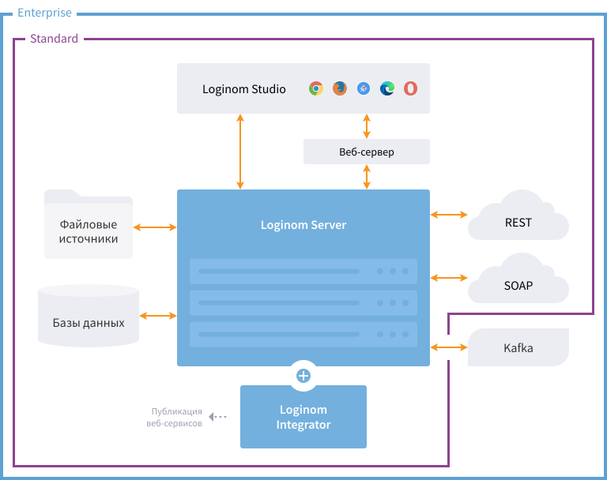

# Loginom для Linux — руководство администратора

Аналитическая платформа [Loginom](https://loginom.ru), установленная на ОС Linux, функционирует в серверном режиме для коллективной работы.

## Teamwork

Серверный режим для ОС Linux доступен в редакциях [Standard](https://help.loginom.ru/userguide/compare-editions.html#standard) и [Enterprise](https://help.loginom.ru/userguide/compare-editions.html#enterprise).

| Component | Designation |
|:----------|:-----------|
| [Loginom Server](./server/README.md) | Ключевой элемент платформы, требует инсталляции. Interaction of all platform components is performed by means of the Loginom Server. |
| [Loginom Studio](../studio/README.md) | The client web application implementing user interface of the platform operation. Installation is not required, as interaction is provided through use of a browser. |
| [Loginom Integrator](./integrator/README.md) | The component required for publication of web services. It is operated with the Loginom Server. В некоторых редакциях может поставляться и устанавливаться вместе с Loginom Server. |
