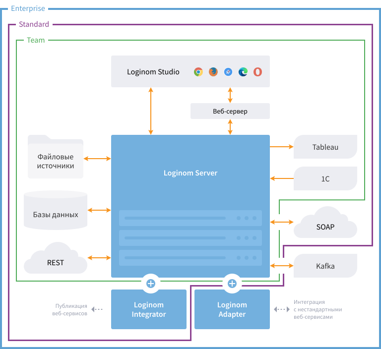

# Loginom для Windows — руководство администратора

The [Loginom](https://loginom.ru) analytical platform can be operated in server mode for teamwork, and as a desktop application for personal analytics.

## Teamwork

Server mode is available in Team, Standard and Enterprise editions.

| Component | Designation |
|:----------|:-----------|
| [Loginom Server](./server/README.md) | Key platform element. It must be installed and can be used as a Windows service. Interaction of all platform components is performed by means of the Loginom Server. |
| [Loginom Studio](../studio/README.md) | The client web application implementing user interface of the platform operation. Installation is not required, as interaction is provided through use of a browser. |
| [Loginom Integrator](./integrator/README.md) | The component required for publication of web services. It is operated with the Loginom Server. It must be installed and can be used as a Microsoft IIS service. |

