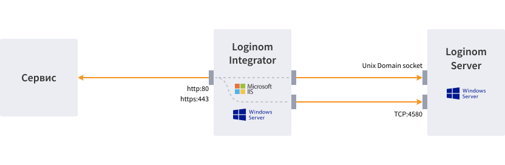

# Loginom Integrator

It is a platform component running as an application for Internet Information Services (IIS) and allowing for publication of the user's own web services.

The Loginom Integrator usage allows for implementation of the solution architecture providing fault tolerance, load balance and horizontal scaling.

## System Requirements

| Component | Minimum | Recommended |
|:--------- |:-------------|:------------- |
| OS | Windows Server 2019 | |
| Software | IIS 8.0 и выше, [ASP.NET Core Runtime 6.0](https://dotnet.microsoft.com/en-us/download/dotnet/6.0) Hosting Bundle | |
| CPU | 2 core | 4 core |
| RAM | 2 GB | 4 GB |
| HDD | 100 GB | 500 GB |

## Interaction of Components

* The external service is connected using http(s) protocol to the web server (IIS) on which Loginom Integrator web application is deployed;
* Integrator enables request processing and creation of connection to TCP [server port](../server/setup.md#parametry-loginom-server) to the Loginom server host.
