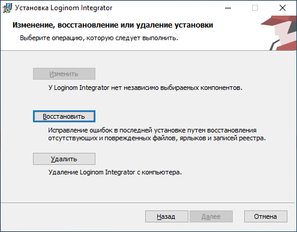

# Uninstalling Loginom Integrator

Loginom Integrator can be uninstalled in several ways:

* удалить приложение из окна "Программы и компоненты" в Windows;
* запустить инсталлятор продукта, нажать кнопку **"Удалить"**:



* выполнить в командной строке от имени администратора:

```cmd
msiexec /x LoginomIntegrator_7.x.x.msi /qn
```
