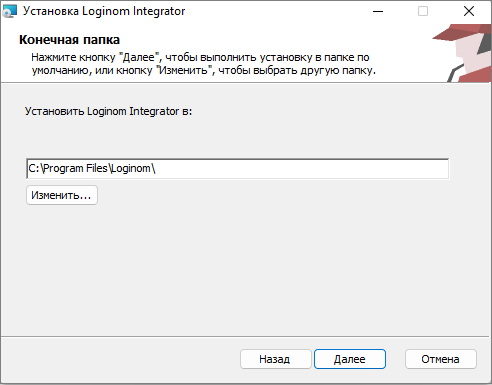
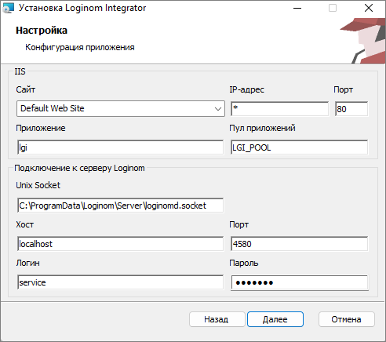

# Loginom Integrator Installation

Имя файла инсталлятора: `LoginomIntegrator_7.x.x.msi`, где 7.x.x – цифры, обозначающие версию и релиз программы.

> **Важно:**
>
> * Версия Loginom Integrator должна соответствовать версии используемого сервера Loginom.
> * Для работы Loginom Integrator требуется установить **[ASP.NET Core Runtime 6.0](https://dotnet.microsoft.com/en-us/download/dotnet/6.0) Hosting Bundle**.

## MSI Installation

### Graphic Interface

#### Run the Installer

It is required to click the  **Custom** button for installation with non-standard parameters in the **Installation type** dialog. To receive parameters of existing IIS sites in the installer interface, it is required to run it with administrator rights.

#### Installation directory

По умолчанию установка производится в каталог `%ProgramFiles%\Loginom\`;



#### Installation Parameters



**IIS** block:

* **Site** is a name of the existing IIS site in which Loginom Integrator will be deployed.
* **IP-адрес**, **Порт** — параметры привязки сайта IIS.
* **Application** — web application name.
* **Application pool** — name of the application pool supporting Loginom Integrator. If the pool does not exist, it will be created.

Блок **Подключение к серверу Loginom**:

* **Unix Socket** — путь до файла, соответствующего Unix domain socket. По умолчанию для всех редакций `%ProgramData%\Loginom\Server\loginomd.socket`. Если Loginom Server находится не на `localhost` относительно Loginom Integrator, то это поле необходимо оставить пустым, чтобы избежать лишних попыток подключения.
* **Host** — the Loginom server host address.
* **Port** — the Loginom server port.
* **Login**, **password** — credentials for [connection to the Loginom server](../server/setup.md#uchetnye-zapisi).

### Command Line

```cmd
msiexec /i "LoginomIntegrator_7.x.x.msi" ключи_msi параметры_integrator
```

* `msi_options` — it is possible to find allowable values executing the following command in the command line: `msiexec /?`. The following commands can be especially useful:
   * `/l* "%TEMP%\loginom.msi.log"` — включение журналирования установки (например, команда `msiexec /i "LoginomIntegrator_7.0.2.msi" /L*v С:\Temp\IntegratorInstallerLog.log` запустит установку Loginom Integrator версии 7.0.2 и запишет полный лог процесса установки в файл IntegratorInstallerLog.log);
   * `/qn` — "тихая" установка без отображения графического интерфейса;
* `integrator_options` in `KEY=value form`:

| Key | Default value | Description |
|:--------- |:-------------|:------------- |
| IIS_APPNAME | `lgi` | IIS web application name |
| IIS_POOLNAME | `LGI_POOL` | Name of the created IIS application pool |
| IIS_WEBSITENAME | `Default Web Site` | IIS site name |
| IIS_WEBSITEIPADDRESS | `0.0.0.0` | IIS site binding address |
| IIS_WEBSITEPORT | `80` | IIS site binding port |
| LGS_HOST | `localhost` | The Loginom Server host |
| LGS_PORT | `4580` | The Loginom Server port |
| LGS_USER | `service` | The Loginom Server account name |
| LGS_PASS | `service` | The Loginom Server account password |
| LGS_UNIXSOCKET | `%ProgramData%\Loginom\Server\loginomd.socket` | Путь до файла, соответствующего Unix domain socket |

## Manual Installation

* To place the Integrator directory content to the required location
* Скорректировать содержимое [Integrator.dll.config](./config.md)
* To create application pool in IIS in the`Integrated` mode and CLR `v4.0` environment version
* To create web application in IIS in the new pool, having specified the path to the Integrator files location

## Function Test

Для проверки работоспособности необходимо в браузере перейти по URL: `http://<Server>/lgi/rest/help`, где `<Server>` — имя хоста.

Loginom Integrator должен отдать страницу с заголовком `Конечные точки в http://<Server>/lgi/rest/help` и текстом: `В настоящий момент не опубликовано ни одного пакета. Для использования пакетов в качестве веб-сервиса необходимо предварительно опубликовать их в Loginom Server.`

Для Loginom Enterprise можно использовать URL `http://<Server>/lgi/openapi/index.html`. В этом случае на странице описания работы с REST сервисом будет сообщение: `No API definition provided.`

Примеры:

`http://localhost/lgi/rest/help`

`http://localhost/lgi/openapi/index.html` — для версии Loginom Enterprise

В редакциях, которые поддерживают публикацию SOAP сервисов (Standard, Enterprise), работоспособность Loginom Integrator можно также проверить по URL `http://<Server>/lgi/soap?wsdl`.

Loginom Integrator должен отдать WSDL SOAP веб-сервиса с предупреждением:

```xml
<wsdl:documentation>
No package published at the present moment. To use the packages as a web service, it is required to publish them in advance in the Loginom Server.
</wsdl:documentation>
```

Пример: `http://localhost/lgi/soap?wsdl`

При установке продукта для этих URL в меню "Пуск" Windows в папку Loginom добавляются ярлыки *"Описание WSDL сервиса"* и *"Описание REST сервиса"*.
