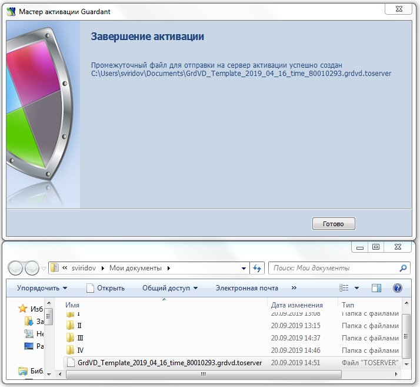
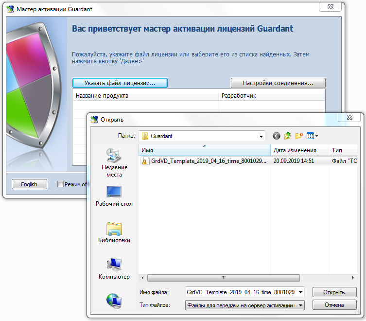
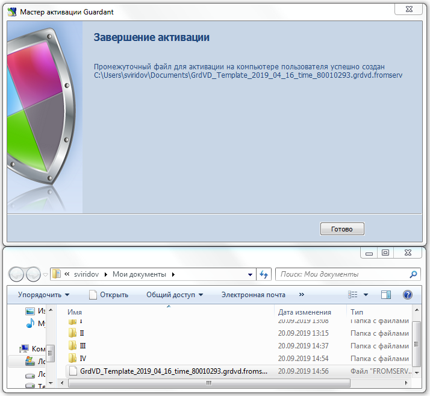
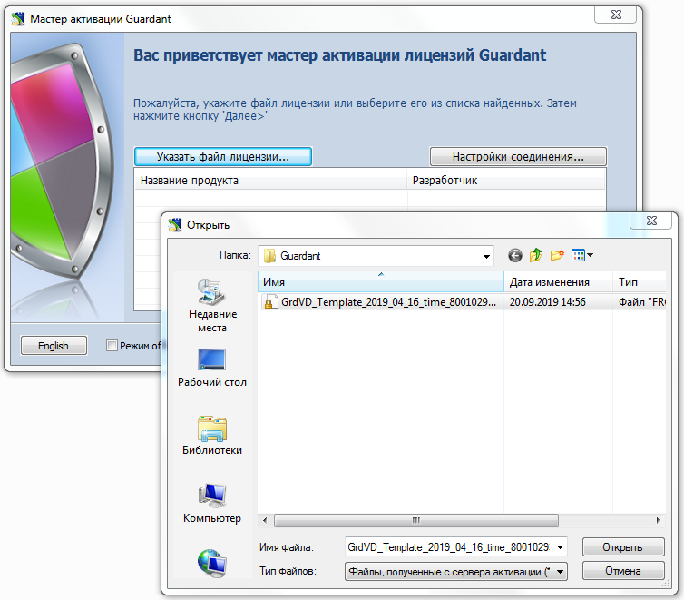
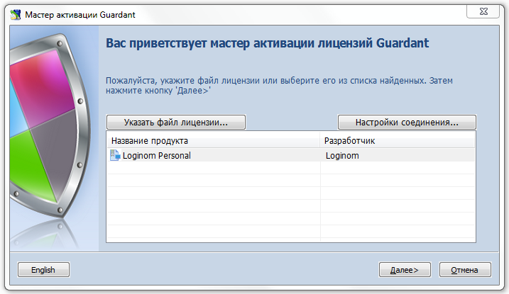

# Активация программного SP-ключа offline

In the case of network unavailability ([online-mode](./sp-key-activate.md)) for the end user computer at the moment of SP dongle activation, [activation is possible in offline mode](https://dev.guardant.ru/pages/viewpage.action?pageId=1278815). To activate Guardant SP dongle in offline-mode, it is required to perfrorm the following actions:

__1.__ Run Guardant Activation Wizard (GuardantActivationWizard.exe is included into the Loginom distribution kit. Если установка Loginom выполнена с настройками по умолчанию, то утилиту можно найти в меню Windows "Пуск", пункт Loginom 6, а также в папке `C:\Program Files\Loginom\Guardant`).

__2.__ Install the "Offline mode" option (shown on the bottom left) and press "Next" button:

__3.__ Enter the software dongle serial number. Then the program will generate a special file to be sent to the activation server:

__4.__ It is required to transfer this file to a computer with net access, run the Activation Wizard (GuardantActivationWizard.exe), press "Specify the license file..." button and specify the "Files for transfer to the activation server (*toserver)" parameter in the drop-down list of the navigation window in the "Files type:" field:

__5.__ The program will connect with the activation server and generate one more file to be transferred to the end user computer to finish the activation process:

__6.__ Run the Activation Wizard on the end user computer(GuardantActivationWizard.exe)

> **Important**: It is not required to install "Offline mode" option

Press "Specify the license file..." button and select the required file in the opened file selection dialog having specified the file type "Files received from the activation server (*.fromserver)":

__7.__ Press "Next":

__8.__ The activation process is complete:

Если в процессе активации возникли каки-либо ошибки, то напишите об этом на [e-mail](mailto:support@loginom.ru).
