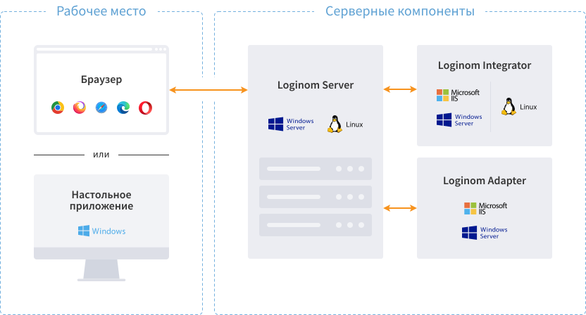

# Loginom — руководство администратора

Аналитическая платформа [Loginom](https://loginom.ru) может функционировать в серверном режиме для коллективной работы и в виде настольного приложения для персональной аналитики.

Серверный режим доступен в редакциях Team, Standard и Enterprise, как для [Windows](./windows/README.md), так и для [Linux](./linux/README.md).

Настольное приложение, предназначенное для автономной обработки данных на персональном компьютере, доступно в редакциях Community и Personal. Они содержат единственный компонент [Loginom Desktop](./desktop/README.md).

> **Примечание:** на данный момент настольные редакции доступны только для ОС Windows.

Требуют инсталляции и функционируют в виде Windows приложения.
