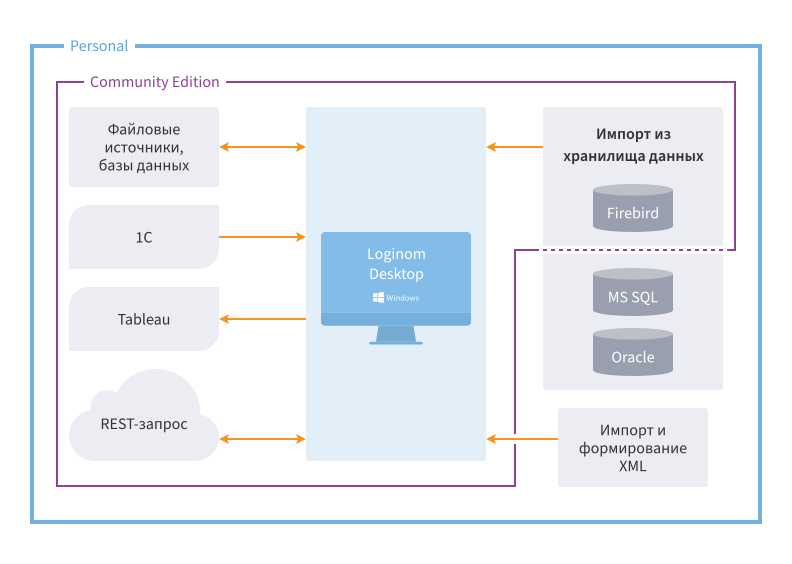

# Loginom Desktop

Настольная версия платформы предназначена для установки на локальном компьютере, когда подразумевается работа одного пользователя.

> **Примечание:** на данный момент настольные редакции доступны только для ОС Windows.

Loginom Desktop способна обработать большие массивы данных, ограниченные только ресурсами рабочей станции. Loginom Desktop не включает инструменты для совместной работы, разграничения прав, публикации и работы с веб-сервисами.

Компонент Desktop входит в редакции платформы Loginom Personal и Loginom Community.

## Системные требования

> **Важно:** При переходе с Loginom 6.Х на 7.X нужно обновить [лицензионный ключ](../licenses_general/README.md).

### Loginom Personal, Loginom Community

| Компонент | Минимальные | Рекомендуемые |
|:--------- |:-------------|:------------- |
| OS | Windows 10 и выше | |
| CPU | 2 core 1| 16 core 1|
| RAM | 4 GB | 8 GB |
| Disk Space  | 1 GB | 10 GB (+ User Data) |

> **Примечание:** Системные требования могут меняться в зависимости от объемов данных и взаимодействия со сторонними приложениями.

1 Поддерживается работа на x64 процессорах Intel Core, AMD FX и более новых, содержащих инструкции [SSE4.2](https://wikipedia.org/wiki/SSE4#SSE4.2) (POPCNT, LZCNT).