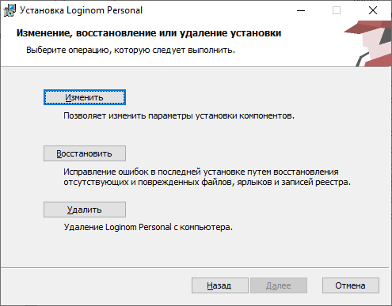

# Удаление Loginom Desktop

Деинсталлировать **"Loginom Desktop"** можно несколькими способами:

* удалить приложение из окна "Программы и компоненты" в Windows;
* запустить инсталлятор продукта, нажать кнопку **"Удалить"**



* выполнить в командной строке от имени администратора:

```cmd
msiexec /x LoginomPersonal_7.x.x.msi /qn
```
