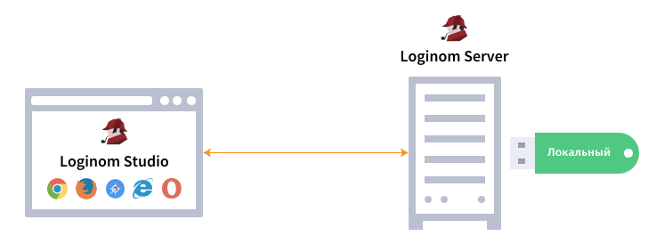
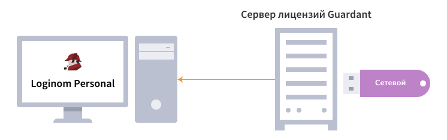

# Лицензионные ключи

Лицензирование продуктов Loginom осуществляется с помощью ключей Guardant. В зависимости от установленной OS ключ имеет разные варианты установки и обновления. Ключи бывают двух основных типов: физический (USB) и програмный (SP). Рассмотрим их подробнее:

* **Локальный USB-ключ** — физический ключ, который рекомендуется для использования единичных экземпляров Loginom на серверах с физическим доступом к usb портам.

* **Сетевой USB-ключ** — физический ключ, который рекомендуется для использования большого количества экземпляров Loginom в локальной сети. Требует развертывания [сервера сетевых ключей](https://www.guardant.ru/support/users/server/) версии не ниже 7.0.

* **Программный SP-ключ** — программный ключ, рекомендуемый для использования единичных экземпляров Loginom в виртуальных средах без физического доступа к usb портам.

> **Важно**: Особенностью программного SP-ключа является криптографическая привязка к оборудованию, т.е. после активаци SP-ключ нельзя повторно автивировать или пренести на другой компьютер.

Пользователю доступны несколько [вариантов исполнения физического ключа](./case.md).

## Активация программного SP-ключа

Перед использованием компонентов платформы программый SP-ключ необходимо активировать.

[Инструкция по активации программного SP-ключа для Widows](../windows/licenses/sp-key-activate.md).

[Инструкция по активации программного SP-ключа для Linux](../linux/licenses/sp-key-activate.md).

## Активация программного SP-ключа для систем без интернета

Перед использованием компонентов платформы программый SP-ключ необходимо активировать, но интернет на компьютере конечного пользователя недоступен.

[Инструкция по активации программного SP-ключа для Windows offline](../windows/licenses/sp-key-activate-offline.md).

[Инструкция по активации программного SP-ключа для Linux offline](../linux/licenses/sp-key-activate.md).

## Обновление аппаратных USB-ключей

Необходимость перепрограммирования USB-ключа возникает при покупке дополнительных лицензий на компоненты или опции Loginom, — в этом случае выполняется дистанционное изменение содержимого памяти ключа с обменом специальными кодами по электронной почте.

[Инструкция по обновлению USB-ключей для Windows](../windows/licenses/usb-upgrade.md).