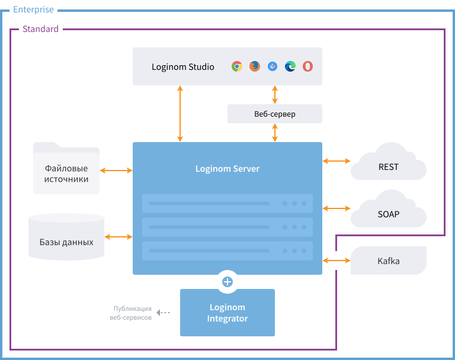

# Loginom для Linux — руководство администратора

Аналитическая платформа [Loginom](https://loginom.ru), установленная на ОС Linux, функционирует в серверном режиме для коллективной работы.

## Коллективная работа

Серверный режим для ОС Linux доступен в редакциях [Standard](https://help.loginom.ru/userguide/compare-editions.html#standard) и [Enterprise](https://help.loginom.ru/userguide/compare-editions.html#enterprise).

| Компонент | Назначение |
|:----------|:-----------|
| [Loginom Server](./server/README.md) | Ключевой элемент платформы, требует инсталляции. Взаимодействие между всеми компонентами платформы осуществляется через Loginom Server.|
| [Loginom Studio](../studio/README.md) | Клиентское веб-приложение, реализующее пользовательский интерфейс работы с платформой. Не требует инсталляции, т.к. взаимодействие осуществляется через браузер. |
| [Loginom Integrator](./integrator/README.md) | Компонент, необходимый для публикации веб-сервисов. Работает совместно с Loginom Server. В некоторых редакциях может поставляться и устанавливаться вместе с Loginom Server.|
