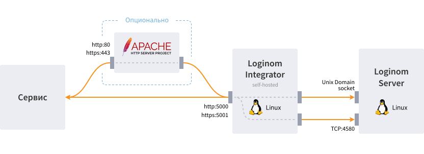

# Loginom Integrator

Компонент платформы, предоставляющий возможность публиковать собственные веб-сервисы.

Применение Loginom Integrator позволяет реализовать архитектуру решения, обеспечивающую отказоустойчивость, балансировку нагрузки и горизонтальное масштабирование.

## Системные требования

| Компонент | Минимальные | Рекомендуемые |
|:--------- |:-------------|:------------- |
| OS | Ядро Linux версии 5.5 и выше | |
| CPU x64 | 4 core ([SSE4.2](https://ru.wikipedia.org/wiki/SSE4#%D0%9D%D0%BE%D0%B2%D1%8B%D0%B5_%D0%B8%D0%BD%D1%81%D1%82%D1%80%D1%83%D0%BA%D1%86%D0%B8%D0%B8_SSE4.2))  | 16 core ([SSE4.2](https://ru.wikipedia.org/wiki/SSE4#%D0%9D%D0%BE%D0%B2%D1%8B%D0%B5_%D0%B8%D0%BD%D1%81%D1%82%D1%80%D1%83%D0%BA%D1%86%D0%B8%D0%B8_SSE4.2)) (Users x 1.6 core + 1 core) |
| RAM | 8 GB | 16 GB (Users x 2GB + 2GB) |
| Disk Space |200 GB | от 500 GB (+ User Data) |
| Ping delay | <50мс | <15мс |

## Взаимодействие компонентов

Вызов сервисов Loginom можно производить, обращаясь напрямую к Integrator, а также опционально через Apache HTTP Server:

## Установка

Если Integrator поставляется вместе с [Loginom Server](../server/README.md), то они устанавливаются одновременно (при инсталляции Server-а). Каких-либо дополнительных действий в таком случае не требуется.
