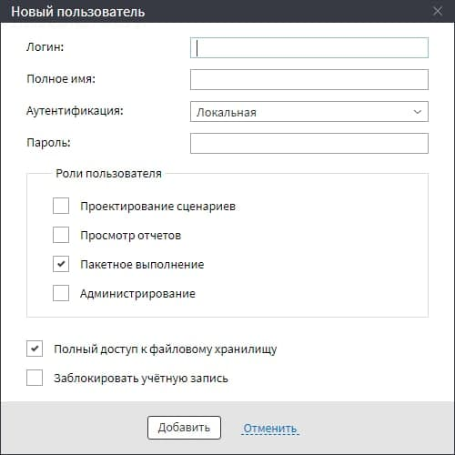

# Пакетный режим BatchLauncher

[Пакетный режим](https://loginom.ru/blog/automatic-start) предназначен для повторного использования подготовленного сценария, если при этом дополнительных действий с ним не предусмотрено.

В пакетном режиме запуск осуществляется с помощью утилиты **BatchLauncher**, поставляемой вместе с сервером Loginom редакции *Team*, *Standard* и *Enterprise*.

По умолчанию путь к файлу утилиты:

`C:\Program Files\Loginom\Server\BatchLauncher.exe`

С пакетным режимом можно работать как с сервера, так и с удаленного доступа. Также запускать его может любой пользователь, достаточно дать ему права на данный сервис.

Обработка в пакетном режиме может стартовать как вручную, так и по расписанию с помощью сторонней программы (планировщика задач), например, Task Scheduler в Windows или Cron в Linux.

## Запуск BatchLauncher

Запуск пакетного режима можно осуществить через командную строку. В общем виде простейшая команда выглядит так:

```cmd
<Путь к утилите BatchLauncher>/Package=<Путь к файлу пакета>
```

Пример запуска **BatchLauncher** с серверного компьютера:

```cmd
"C:\Program Files\Loginom\Server\BatchLauncher.exe"/Package=/user/file.lgp
```

Подробное описание команд есть в [справке пользователя](https://help.loginom.ru/userguide/scenario/batchlauncher.html).

Далее рассмотрим, как запускать пакетный режим без доступа к серверу.

Необходимо создать нового пользователя с пакетным выполнением и доступом к файловому хранилищу (см. Рисунок 1) или добавить эти настройки к существующему пользователю. Для этого нужно через администратора зайти `\Администрирование\Пользователи` и добавить необходимые "галочки".



Логин и пароль любой.

Также необходимо скопировать файл **BatchLauncher.exe** на компьютер аналитика с сервера. Далее действуем по инструкции и запускаем через командную строку пакетный режим.

```cmd
"C:\Program Files\Loginom\BatchLauncher.exe" /Package="../user/Komarova/Calendar.lgp" /address="192.168.0.152" /Port="4580" /userName="paket" /Password=""
```

Запуск с помощью планировщика задач выполняется так же, как через серверную версию.
