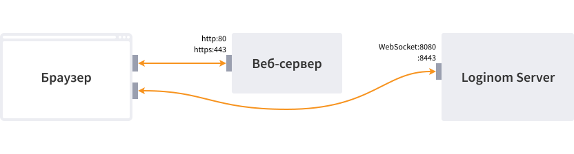
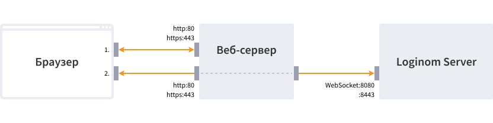

# Studio

Клиентское веб-приложение, предназначенное для проектирования сценариев обработки, визуализации данных, настройки сервера, управления правами пользователей. Обработка данных выполняется [Loginom Server](../windows/server/README.md)-ом.

Studio – основное рабочее место аналитика и конечного пользователя, реализующее [пользовательский интерфейс](https://help.loginom.ru) работы с платформой.

Поддерживаются браузеры:

* [Chrome](https://www.google.ru/chrome/) не ниже 84.0
* [Chrome Android](https://play.google.com/store/apps/details?id=com.android.chrome&hl=en&gl=US)  не ниже 84.0
* [Firefox](https://www.mozilla.org/en-US/firefox/organizations/) не ниже 79.0
* [Opera](http://www.opera.com/ru) не ниже 70.0
* [Safari](https://www.apple.com/ru/safari/) не ниже 14.1
* [Edge](https://www.microsoft.com/ru-ru/windows/microsoft-edge) не ниже 84.0
* прочие браузеры на базе [Chromium](https://www.chromium.org/getting-involved/download-chromium/) не ниже 84.0

Параметры подключения к Loginom Server задаются в [файле конфигурации](./config.md).

## Взаимодействие компонентов

Studio обменивается данными с Loginom Server по протоколу [websocket](https://ru.wikipedia.org/wiki/WebSocket). Соединение может устанавливаться одним из двух способов - напрямую с сервером Loginom, либо через websocket proxy, настроенном на web-сервере.

Websocket proxy позволяет предоставлять доступ к Loginom Server через http(s) порт web-сервера, что упрощает конфигурацию сетевых экранов.

Для включения wsproxy на встроенном web-сервере достаточно отметить пункт "Использовать WebSocket proxy" [при установке](../windows/server/setup.md#parametry-web-servera-apache-httpd), IIS требует более сложной [настройки](../windows/server/iis.md#nastroyka-websocket-proxy).

При установке по умолчанию websocket proxy отключен.

### Без wsproxy

* Браузер подключается к web-серверу по протоколу `http` и загружает Loginom Studio:
  * `http://web-server-host:80/app` - URL подключения, если шифрование http не включено;
  * `https://web-server-host:443/app` - URL подключения, если шифрование http включено.
* Из конфигурации [server.json](../studio/config.md) формируется URL для подключения к серверу Loginom;
* Loginom Studio создает подключение на хост сервера Loginom по протоколу `websocket`:
  * `ws://loginom-server-host:8080/ws` - URL подключения, если шифрование websocket [не включено](../windows/server/setup.md#parametry-loginom-server). При наличии шифрования http подключение запрещено.
  * `wss://loginom-server-host:8443/ws` - URL подключения, если шифрование websocket [включено](../windows/server/setup.md#parametry-loginom-server).

### С использованием wsproxy

* Браузер подключается к web-серверу по протоколу `http` и загружает Loginom Studio:
  * `http://web-server-host:80/app` - URL подключения, если шифрование http не включено;
  * `https://web-server-host:443/app` - URL подключения, если шифрование http включено.
* Из конфигурации [server.json](../studio/config.md) формируется URL для подключения к серверу Loginom;
* Loginom Studio подключается к хосту web-сервера по протоколу `websocket`:
  * `ws://web-server-host:80/ws` - URL подключения, если не включено шифрование ни http, ни websocket;
  * `wss://web-server-host:443/ws`  - URL подключения, если включено шифрование http либо websocket.
* Web-сервер создает подключение на хост сервера Loginom по протоколу `websocket` и перенаправляет в него траффик соединения с Loginom Studio:
  * `ws://loginom-server-host:8080/ws` - URL подключения, если шифрование websocket [не включено](../windows/server/setup.md#parametry-loginom-server);
  * `wss://loginom-server-host:8443/ws` - URL подключения, если шифрование websocket [включено](../windows/server/setup.md#parametry-loginom-server).