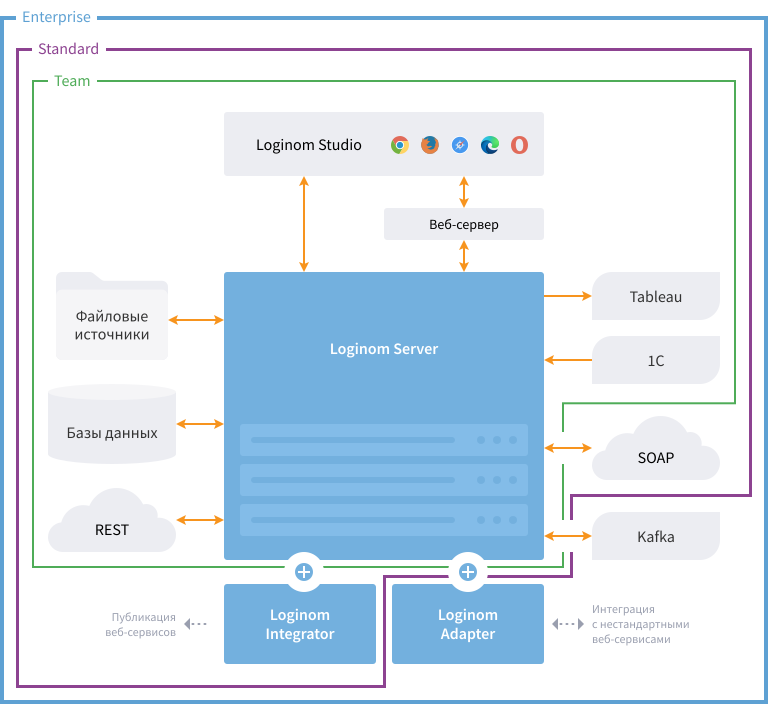

# Loginom для Windows — руководство администратора

Аналитическая платформа [Loginom](https://loginom.ru) может функционировать в серверном режиме для коллективной работы и в виде настольного приложения для персональной аналитики.

## Коллективная работа

Серверный режим доступен в редакциях Team, Standard и Enterprise.

| Компонент | Назначение |
|:----------|:-----------|
| [Loginom Server](./server/README.md) | Ключевой элемент платформы. Требует инсталляции и функционирует в виде службы Windows. Взаимодействие между всеми компонентами платформы осуществляется через Loginom Server.|
| [Loginom Studio](../studio/README.md) | Клиентское веб-приложение, реализующее пользовательский интерфейс работы с платформой. Не требует инсталляции, т.к. взаимодействие осуществляется через браузер. |
| [Loginom Integrator](./integrator/README.md) | Компонент, необходимый для публикации веб-сервисов. Работает совместно с Loginom Server. Требует инсталляции и функционирует в виде службы Microsoft IIS.|

