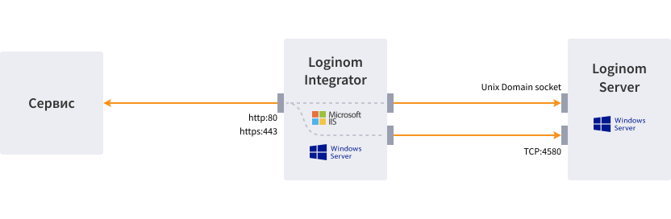

# Loginom Integrator

Компонент платформы, функционирующий в виде приложения для Internet Information Services (IIS) и предоставляющий возможность публиковать собственные веб-сервисы.

Применение Loginom Integrator позволяет реализовать архитектуру решения, обеспечивающую отказоустойчивость, балансировку нагрузки и горизонтальное масштабирование.

## Системные требования

| Компонент | Минимальные | Рекомендуемые |
|:--------- |:-------------|:------------- |
| OS | Windows Server 2019 | |
| Software | IIS 8.0 и выше, [ASP.NET Core Runtime 6.0](https://dotnet.microsoft.com/en-us/download/dotnet/6.0) Hosting Bundle | |
| CPU | 2 core | 4 core |
| RAM | 2 GB | 4 GB |
| HDD | 100 GB | 500 GB |

## Взаимодействие компонентов

* Внешний сервис подключается по протоколу http(s) к web-серверу (IIS), на котором развернуто web-приложение Loginom Integrator;
* Integrator обрабатывает запрос и создает подключение на TCP [порт сервера](../server/setup.md#parametry-loginom-server) к хосту сервера Loginom.
