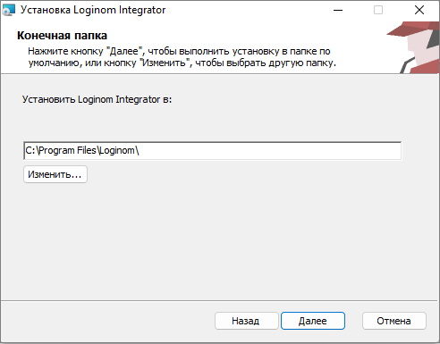
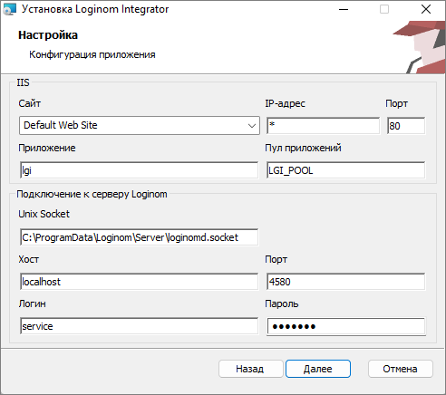

# Установка Loginom Integrator

Имя файла инсталлятора: `LoginomIntegrator_7.x.x.msi`, где 7.x.x – цифры, обозначающие версию и релиз программы.

> **Важно:**
>
> * Версия Loginom Integrator должна соответствовать версии используемого сервера Loginom.
> * Для работы Loginom Integrator требуется установить **[ASP.NET Core Runtime 6.0](https://dotnet.microsoft.com/en-us/download/dotnet/6.0) Hosting Bundle**.

## Установка MSI

### Графический интерфейс

#### Запуск инсталлятора

Для установки с нестандартными параметрами в диалоге **"Тип установки"** нажимаем кнопку **"Выборочная"**. Для получения параметров существующих сайтов IIS в интерфейсе инсталлятора требуется запустить его с правами администратора.

#### Каталог установки

По умолчанию установка производится в каталог `%ProgramFiles%\Loginom\`;



#### Параметры установки



Блок **IIS**:

* **Сайт** — имя существующего сайта IIS, на котором будет развернут Loginom Integrator.
* **IP-адрес**, **Порт** — параметры привязки сайта IIS.
* **Приложение** — имя web-приложения.
* **Пул приложений** — имя пула приложений, обслуживающего Loginom Integrator. Если пул не существует, он будет создан.

Блок **Подключение к серверу Loginom**:

* **Unix Socket** — путь до файла, соответствующего Unix domain socket. По умолчанию для всех редакций `%ProgramData%\Loginom\Server\loginomd.socket`. Если Loginom Server находится не на `localhost` относительно Loginom Integrator, то это поле необходимо оставить пустым, чтобы избежать лишних попыток подключения.
* **Хост** — адрес хоста сервера Loginom.
* **Порт** — порт сервера Loginom.
* **Логин**, **Пароль** — реквизиты для [подключения к серверу Loginom](../server/setup.md#uchetnye-zapisi).

### Командная строка

```cmd
msiexec /i "LoginomIntegrator_7.x.x.msi" ключи_msi параметры_integrator
```

* `ключи_msi` — допустимые значения можно узнать, выполнив в командной строке `msiexec /?`. Особо полезными могут быть:
  * `/l* "%TEMP%\loginom.msi.log"` — включение журналирования установки (например, команда `msiexec /i "LoginomIntegrator_7.0.2.msi" /L*v С:\Temp\IntegratorInstallerLog.log` запустит установку Loginom Integrator версии 7.0.2 и запишет полный лог процесса установки в файл IntegratorInstallerLog.log);
  * `/qn` — "тихая" установка без отображения графического интерфейса;
* `параметры_integrator` в виде `КЛЮЧ=значение`:

| Ключ | Значение по умолчанию | Описание |
|:--------- |:-------------|:------------- |
| IIS_APPNAME | `lgi` | Имя web-приложения IIS |
| IIS_POOLNAME | `LGI_POOL` | Имя создаваемого пула приложений IIS |
| IIS_WEBSITENAME |  `Default Web Site` | Имя сайта IIS |
| IIS_WEBSITEIPADDRESS | `0.0.0.0` | Адрес привязки сайта IIS |
| IIS_WEBSITEPORT | `80` | Порт привязки сайта IIS |
| LGS_HOST | `localhost` | Хост Loginom Server |
| LGS_PORT | `4580` | Порт Loginom Server |
| LGS_USER | `service` | Имя учетной записи Loginom Server |
| LGS_PASS | `service` | Пароль учетной записи Loginom Server |
| LGS_UNIXSOCKET | `%ProgramData%\Loginom\Server\loginomd.socket` | Путь до файла, соответствующего Unix domain socket |

## Ручная установка

* Поместить содержимое каталога Integrator в требуемое расположение
* Скорректировать содержимое [Integrator.dll.config](./config.md)
* Создать в IIS пул приложений в режиме `Integrated` и версией среды CLR `v4.0`
* Создать в IIS web-приложение в новом пуле, указав путь к расположению файлов Integrator

## Проверка работоспособности

Для проверки работоспособности необходимо в браузере перейти по URL: `http://<Server>/lgi/rest/help`, где `<Server>` — имя хоста.

Loginom Integrator должен отдать страницу с заголовком `Конечные точки в http://<Server>/lgi/rest/help` и текстом: `В настоящий момент не опубликовано ни одного пакета. Для использования пакетов в качестве веб-сервиса необходимо предварительно опубликовать их в Loginom Server.`

Для Loginom Enterprise можно использовать URL `http://<Server>/lgi/openapi/index.html`. В этом случае на странице описания работы с REST сервисом будет сообщение: `No API definition provided.`

Примеры:

`http://localhost/lgi/rest/help`

`http://localhost/lgi/openapi/index.html` — для версии Loginom Enterprise

В редакциях, которые поддерживают публикацию SOAP сервисов (Standard, Enterprise), работоспособность Loginom Integrator можно также проверить по URL `http://<Server>/lgi/soap?wsdl`.

Loginom Integrator должен отдать WSDL SOAP веб-сервиса с предупреждением:

```xml
<wsdl:documentation>
В настоящий момент не опубликовано ни одного пакета. Для
использования пакетов в качестве веб-сервиса необходимо
предварительно опубликовать их в Loginom Server.
</wsdl:documentation>
```

Пример: `http://localhost/lgi/soap?wsdl`

При установке продукта для этих URL в меню "Пуск" Windows в папку Loginom добавляются ярлыки *"Описание WSDL сервиса"* и *"Описание REST сервиса"*.
