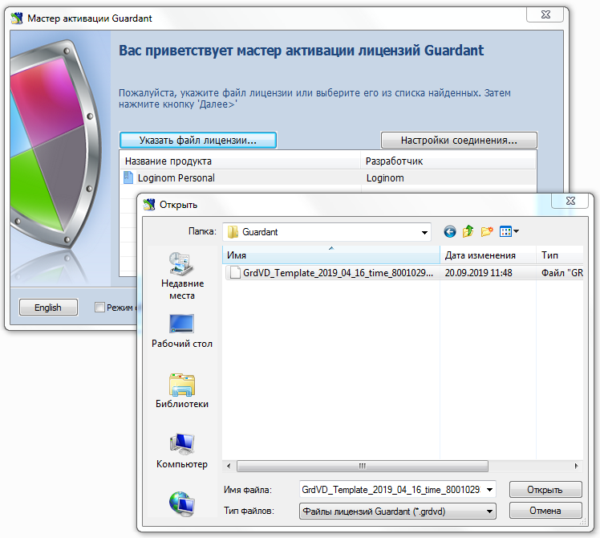
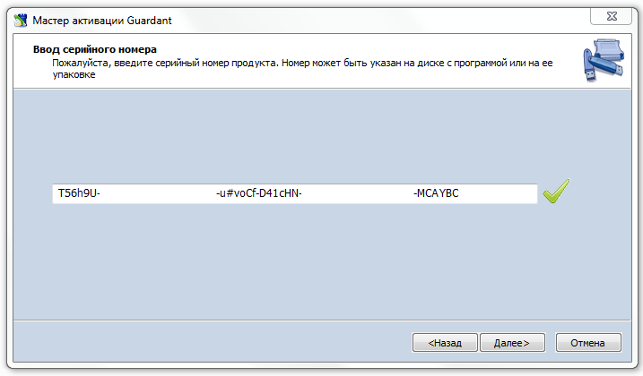
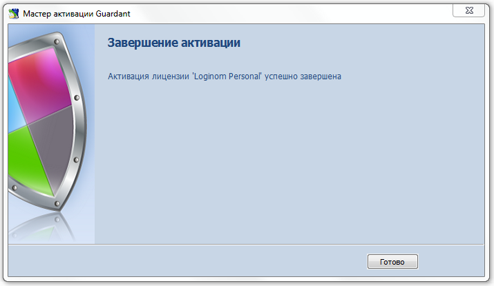

# Активация программного SP-ключа online

Для успешной активации ключа требуется:

* Установленный драйвер Guardant версии не ниже 7.0.
* Утилита GuardantActivationWizard.exe, поставляющаяся в комплекте с SP-ключом (входит в состав дистрибутива Loginom).
* Запрограммированный шаблон ключа Guardant SP (файл вида *.grdvd).
* Серийный номер вида `9XZrwR-XXXXX-7NGDyS-XXXXX-qZGBcW-XXXXX-XoLBXF-xwqwXv-8oEO0o-XXXXX`.
* Компьютер, где будет выполняться активация, в процессе инициализации ключа должен иметь доступ к серверу активации по адресу `https://sp.guardant.ru`.

> **Важно**: Особенностью Guardant SP является криптографическая привязка к оборудованию, т.е. активированный ключ нельзя использовать на другом компьютере.

Чтобы активировать ключ Guardant SP, запустите мастер активации GuardantActivationWizard.exe и следуйте его указаниям (если установка Loginom выполнена с настройками по умолчанию, то утилиту можно найти в меню Windows "Пуск", пункт Loginom 6, а также в папке `C:\Program Files\Loginom\Guardant`):

__1.__ При помощи кнопки "Указать файл лицензии" выберите путь к файлу вида *.grdvd. Проверьте настройки Интернет-соединения и нажмите на кнопку "Далее":

__2.__ Укажите в поле ввода серийный номер для активации. Нажмите на кнопку "Далее":

Мастер производит необходимый обмен информацией с драйвером ключа и сервером активации. При этом происходит проверка введенного серийного номера, а также перешифрование файла программного ключа с использованием контрольных значений комплектующих компьютера.

__3.__ Если активация прошла успешно, мастер выдает завершающее диалоговое окно:

Если в процессе активации возникли каки-либо ошибки, то напишите об этом на [e-mail](mailto:support@loginom.ru).